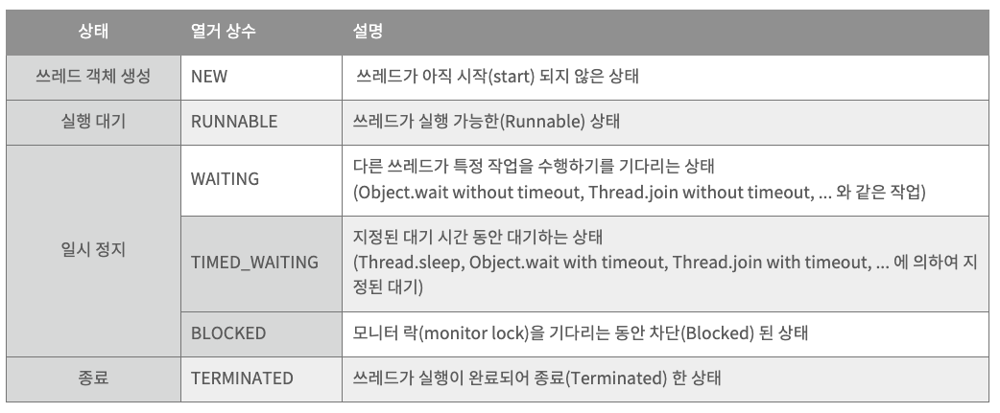
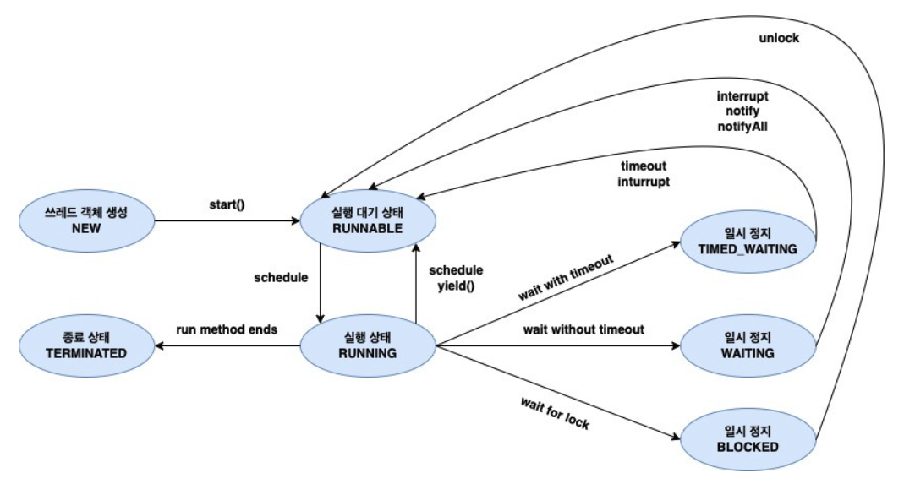

## 스레드 상태에 대해 설명해주세요. 혹시 TIMED_WATING이랑 WAITING의 차이를 아시나요?

Java에서는 스레드의 상태를 아래의 열거형 상수(enum)을 이용해서 표기.

```java
public enum State {
    NEW,
    RUNNABLE,
    BLOCKED,
    WAITING,
    TIMED_WAITING,
    TERMINATED
}
```

<br/>

## WAITING vs TIMED_WAITING 차이점

- 둘 다 스레드가 대기 중이지만, 주어진 시간이 있는지 여부가 핵심 차이입니다.

- **WAITING (무기한 대기)**
    - 스레드는 특정 이벤트가 발생할 때까지 무기한 대기합니다.
    - notify() 또는 notifyAll()을 호출해야만 깨어날 수 있습니다.
    - 대표적인 메서드:
        - Object.wait()
        - Thread.join() (매개변수 없는 버전)
        - LockSupport.park()
- **TIMED_WAITING (일정 시간 후 자동 해제)**
    - 일정 시간이 지나면 자동으로 깨어납니다.
    - 대표적인 메서드:
        - Thread.sleep(ms)
        - Object.wait(ms)
        - Thread.join(ms)
        - LockSupport.parkNanos(ns)
        - LockSupport.parkUntil(deadline)

### 스레드 상태 별 설명



### 스레드 상태 다이어그램

