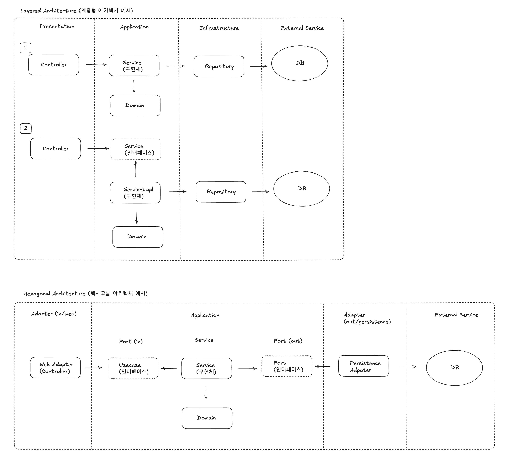

## Layered Architecture & Hexagonal Architecture

1. **Layered Architecture (계층형 아키텍처)**

**구조**

- 일반적으로 **Presentation → Service → Repository** 형태로 계층을 나눔
- 각 계층은 **하위 계층**만 호출할 수 있음 (단방향 의존성)

 

**특징**

- **장점**
    - 구현이 쉽고, Spring Boot 기본 구조와 잘 맞음
    - 팀원 간 역할 분리가 쉬움 (프론트엔드 ↔ 백엔드 ↔ DB)
    - 작은 프로젝트에서 유지보수가 쉬움
- **단점**
    - 변경이 어려움 (Repository 변경 시 Service, Controller도 영향을 받음)
    - 테스트가 어렵고 Mocking이 필요함
    - 계층 간 강한 결합 (결합도가 높아지는 문제)

 

**2. Hexagonal Architecture (Ports & Adapters 패턴, 헥사고날 아키텍처)**

**구조**

- 도메인 로직을 중심으로 두고, **입력(Ports)과 출력(Adapters)** 을 외부에 둠
- Service, Repository와 같은 내부 구현이 바뀌어도 **도메인 로직은 변경되지 않음**

**특징**

- **장점**
    - **비즈니스 로직을 보호** (변경에 덜 영향받음)
    - 테스트가 쉬움 (Mocking 없이 도메인 로직 테스트 가능)
    - **다양한 인터페이스 지원 가능** (REST API, CLI, WebSocket 등 확장성 높음)
- **단점**
    - 복잡도가 증가 (초기 설계가 어려움)
    - Spring Boot 기본 스타일과 다르므로 팀원 학습 필요
    - 작은 프로젝트에서는 오버엔지니어링 가능

 

**3. Layered ↔ Hexagonal 아키텍처 비교**

|             | **Layered Architecture**                | **Hexagonal Architecture**  |
|-------------|-----------------------------------------|-----------------------------|
| **의존성 방향**  | Controller → Service → Repository (단방향) | Domain이 핵심, Adapter(외부 의존성) |
| **유지보수성**   | 변경이 어렵고, 계층 영향 큼                        | 변경에 강하고, 확장 가능              |
| **테스트 용이성** | Mocking 필요                              | 도메인 단위 테스트 가능               |
| **복잡도**     | 비교적 단순                                  | 상대적으로 복잡                    |

 

4. **개인적인 생각 (실무 적용 관점)**

**Layered Architecture를 선호하는 경우**

- **Spring Boot 기본 구조**와 잘 맞고, **단순한 CRUD 프로젝트**에서는 충분함
- 팀 내 경험이 부족한 경우 **학습 부담이 적음**

**Hexagonal Architecture를 선호하는 경우**

- MSA 환경에서 **서비스 간 통신, 다양한 Adapter(Web, Kafka, gRPC) 지원이 필요**할 때
- **비즈니스 로직이 복잡하고 변경 가능성이 클 때** 유지보수가 유리함